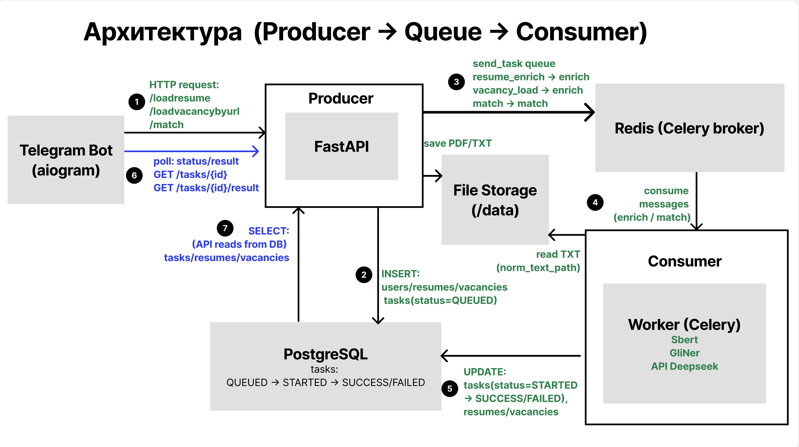
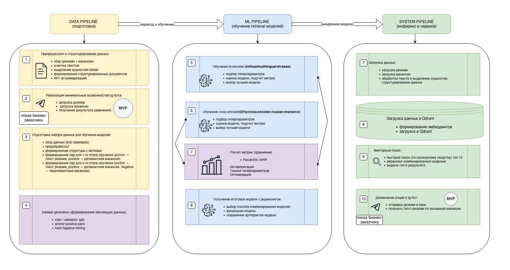
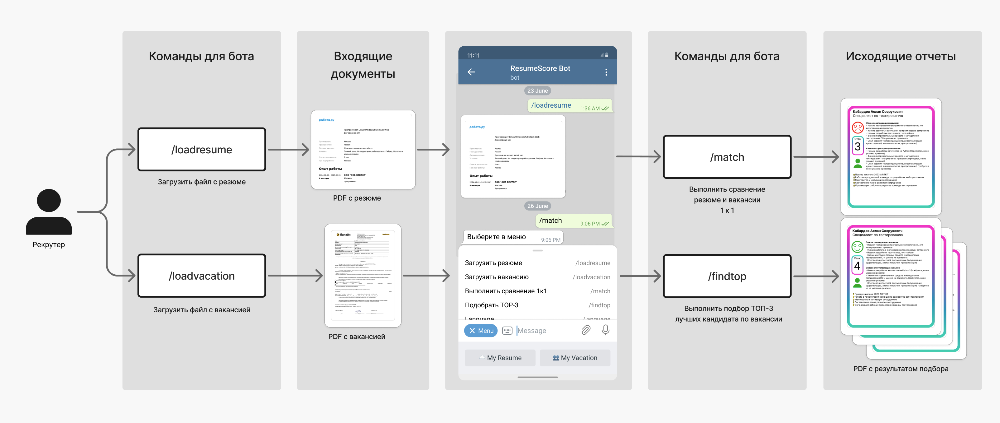

# ML System Design — ResumeMatching

Этот репозиторий содержит **ML System Design документ** для сервиса **ResumeMatching** — системы автоматического сопоставления резюме и вакансий.

Документ описывает проектирование ML-системы для решения задачи **semantic matching и поиска кандидатов** в рекрутинге.

---

## Architecture Overview

Система построена по двухэтапной архитектуре поиска кандидатов:

**1. Semantic retrieval**
- bi-encoder генерирует embeddings резюме и вакансий  
- выполняется поиск ближайших кандидатов в **Qdrant vector database**

**2. Reranking**
- cross-encoder оценивает релевантность пары (резюме, вакансия)  
- формируется итоговый рейтинг кандидатов

---

## Архитектура системы

---

## ML pipeline

---

## Пользовательский сценарий

---

## Документ

Полное описание системы находится в документе:

**[ml_sys_doc.md](ml_sys_doc.md)**

Документ включает:

- постановку задачи  
- ML pipeline  
- обучение моделей  
- архитектуру системы  
- метрики качества  
- пилот и внедрение

---

## Назначение репозитория

Репозиторий создан как **пример ML System Design документа**.