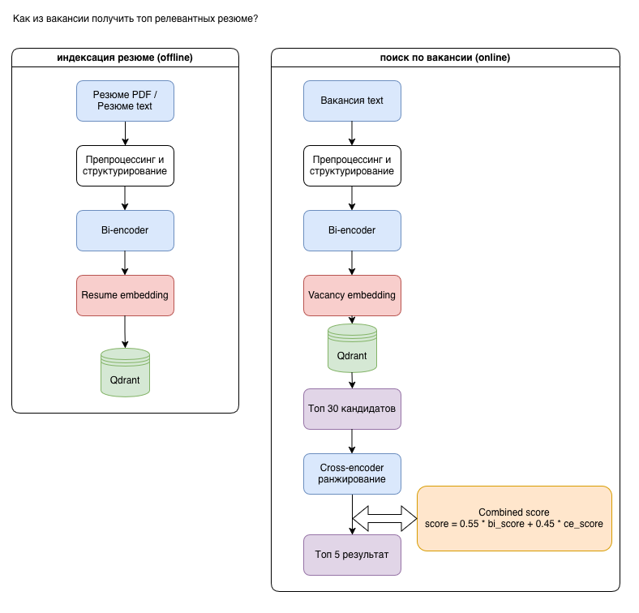

# ML System Design Document

## Дизайн ML сервиса для рекрутера - ResumeMatching

## Содержание

- [Термины и пояснения](#термины-и-пояснения)

### 1. Цели и предпосылки
- [1.1 Обоснованность разработки продукта](#11-обоснованность-разработки-продукта)
- [1.2 Бизнес-требования и ограничения](#12-бизнес-требования-и-ограничения)
- [1.3 Что входит в скоуп проекта/итерации, что не входит](#13-что-входит-в-скоуп-проектаитерации-что-не-входит)
- [1.4 Предпосылки решения](#14-предпосылки-решения)
- [1.5 Пользовательский сценарий работы системы](#15-пользовательский-сценарий-работы-системы)

### 2. Методология
- [2.1 Постановка задачи](#21-постановка-задачи)
- [2.2 Блок-схема решения](#22-блок-схема-решения)
- [2.3 Этапы решения задачи](#23-этапы-решения-задачи)
  - [2.3.1 Этап 1 — Сбор и подготовка данных](#231-этап-1--сбор-и-подготовка-данных)
  - [2.3.2 Этап 2 — MVP](#232-этап-2--mvp)
  - [2.3.3 Этап 3 — Подготовка обучающего датасета](#233-этап-3--подготовка-обучающего-датасета)
  - [2.3.4 Этап 4 — Обучение retrieval модели (bi-encoder)](#234-этап-4--обучение-retrieval-модели-bi-encoder)
  - [2.3.5 Этап 5 — Обучение reranking модели (cross-encoder)](#235-этап-5--обучение-reranking-модели-cross-encoder)
  - [2.3.6 Этап 6 — Интеграция моделей в сервис](#236-этап-6--интеграция-моделей-в-сервис)
  - [2.3.7 Этап 7 — Комбинирование моделей](#237-этап-7--комбинирование-моделей)
  - [2.3.8 Этап 8 — MVP](#238-этап-8--mvp)
  - [2.3.9 Этап 9 — Подготовка к пилоту](#239-этап-9--подготовка-к-пилоту)

### 3. Подготовка пилота
- [3.1 Описание методики пилота](#31-описание-методики-пилота)
- [3.2 Оценка успешности пилота](#32-оценка-успешности-пилота)

### 4. Внедрение в production
- [4.1 Архитектура системы](#41-архитектура-системы)
- [4.2 Компоненты системы](#42-компоненты-системы)
- [4.3 Поток обработки данных](#43-поток-обработки-данных)

## Термины и пояснения

| Термин                       | Описание                                                                                                                                              |
| ---------------------------- | ----------------------------------------------------------------------------------------------------------------------------------------------------- |
| ResumeMatching               | ML-сервис для автоматического анализа резюме и сопоставления кандидатов с вакансиями.                                                                 |
| Резюме (Resume)              | Документ кандидата, содержащий информацию о навыках, опыте работы, образовании и других характеристиках кандидата.                                    |
| Вакансия (Vacancy)           | Описание позиции, включающее требования к кандидату, обязанности, навыки и другие параметры.                                                          |
| Matching                     | Процесс сопоставления резюме и вакансии для определения степени соответствия кандидата требованиям вакансии.                                          |
| Retrieval                    | Процесс поиска наиболее релевантных резюме по заданной вакансии на основе семантического сходства.                                                    |
| Reranking                    | Повторное ранжирование найденных кандидатов с использованием более точной модели оценки релевантности.                                                |
| Bi-encoder                   | Нейронная модель, которая преобразует тексты резюме и вакансий в векторные представления (embeddings), позволяя быстро выполнять семантический поиск. |
| Cross-encoder                | Нейронная модель, которая анализирует пару текстов (резюме и вакансию) совместно и оценивает степень их соответствия. Используется для reranking.     |
| Embedding                    | Векторное представление текста, позволяющее сравнивать документы по смысловому сходству.                                                              |
| Vector search                | Поиск похожих векторных представлений в векторном хранилище по метрике сходства (например, косинусное расстояние).                                    |
| Qdrant                       | Векторная база данных, используемая для хранения embeddings резюме и выполнения быстрого поиска кандидатов.                                           |
| MVP (Minimum Viable Product) | Минимально жизнеспособная версия продукта, реализующая базовые функции системы для проверки гипотез.                                                  |
| Telegram Bot                 | Пользовательский интерфейс системы, через который рекрутер взаимодействует с сервисом.                                                                |

| Обозначение    | Описание                                                                     |
| -------------- | ---------------------------------------------------------------------------- |
| Top-N          | N наиболее релевантных кандидатов, найденных системой.                       |
| Score          | Итоговая оценка соответствия кандидата вакансии.                             |
| Combined score | Итоговый score, полученный как комбинация оценок bi-encoder и cross-encoder. |

### 1. Цели и предпосылки
[⬆ Вернуться к содержанию](#содержание)  

#### 1.1. Обоснованность разработки продукта  

Основная бизнес-цель разработки сервиса ResumeMatching — ускорить первичный скрининг резюме и повысить релевантность подбора кандидатов под конкретную вакансию.

Сервис решает следующие задачи:
* сокращение времени ручного просмотра резюме;
* унификация представления информации о кандидате (структурированная карточка кандидата);
* стандартизация первичной оценки кандидатов;
* автоматическое формирование короткого списка наиболее релевантных кандидатов;
* повышение качества сопоставления резюме и вакансий;
* снижение операционных затрат на первичный этап рекрутинга за счёт автоматизации анализа резюме.

Описание текущего бизнес-процесса:
В текущем процессе подбор кандидатов выполняется вручную и включает следующие этапы:
1. получение резюме из различных источников (job-сайты, почта, базы резюме);
2. ручной анализ содержания резюме;
3. ручной отбор кандидатов по релевантности вакансии;
4. ручное ранжирование кандидатов и формирование списка кандидатов.

Данный процесс требует значительных временных затрат со стороны рекрутеров и может приводить к ошибкам из-за субъективной оценки и ограниченного знания предметной области.

Критерии успеха системы:
* повышение точности ранжирования кандидатов по сравнению с ручным отбором;
* увеличение доли релевантных кандидатов в верхних позициях ранжирования;
* сокращение среднего времени подбора кандидата;
* увеличение доли кандидатов, успешно прошедших испытательный срок;
* увеличение среднего срока работы сотрудников, подобранных с использованием системы.

Для количественной оценки эффективности системы используются следующие метрики:

| Метрика | Тип | Описание |
|---|---|---|
| Recall@5 | ML | доля релевантных кандидатов среди первых 5 |
| MRR | ML | позиция первого релевантного кандидата |
| Time reduction | Продуктовая | снижение времени подбора |
| Relevant candidates in Top-5 | Продуктовая | качество списка кандидатов |
| Time to hire | Бизнес | время закрытия вакансии |
| Cost per hire | Бизнес | стоимость найма |

Подробнее:

1. **Recall@N** - метрика оценки качества поиска кандидатов.     

$$
Recall@N = \frac{|\text{Relevant} \cap \text{TopN}|}{|\text{Relevant}|}
$$

где  
Relevant — все кандидаты, которые действительно подходят под вакансию
TopN — первые N кандидатов, выданные системой
Метрика показывает, какую долю всех релевантных кандидатов система смогла найти среди первых N результатов.  

2.  **MRR (Mean Reciprocal Rank)** - метрика оценки качества ранжирования кандидатов.   

$$
MRR = \frac{1}{Q} \sum_{i=1}^{Q} \frac{1}{rank_i}
$$ 

где
- Q — количество вакансий (запросов)
- rank_i — позиция первого релевантного кандидата для вакансии   
метрика поощряет ситуации, когда релевантные кандидаты находятся в начале списка.

3. **Time reduction** - Снижение времени подбора

$$
Time\_reduction = \frac{T_{manual} - T_{ml}}{T_{manual}}
$$   
 
где
- $T_{manual}$ — среднее время подбора без ML  
- $T_{ml}$ — среднее время подбора с системой

4. **Relevant candidates in Top-5** - показывает качество рекомендаций системы, насколько полезен результат для пользователя.

$$
Relevant@5 = \frac{|Relevant \cap Top5|}{5}
$$

Relevant - множество релевантных кандидатов  
Top5 - первые 5 кандидатов в выдаче

5. **Time to hire** — метрика показывает время закрытия вакансии.

$$
Time\_to\_hire = t_{\text{hire}} - t_{\text{open}}
$$  

где:

text_open — момент открытия вакансии  
text_hire — момент найма кандидата

6.  **Cost per hire** - метрика стоимости найма кандидата.
   

$$
Cost\_per\_hire = \frac{C_{recruiting}}{N_{hires}}
$$  

C_recruiting — суммарные расходы на рекрутинг  
N_hires — количество нанятых кандидатов  

#### 1.2. Бизнес-требования и ограничения  

Целевое видение:  

- Система ResumeMatching предназначена для автоматизации первичного этапа подбора кандидатов и повышения эффективности процесса рекрутинга.
- Необходимо автоматически сопоставлять резюме кандидатов и вакансии, формируя ранжированный список наиболее релевантных кандидатов.
- Система должна обеспечивать следующие возможности:
  * автоматический анализ резюме кандидатов;
  * извлечение структурированной информации из резюме (опыт работы, навыки, образование, роли);
  * формирование краткой AI-суммаризации кандидата;
  * вычисление семантических представлений (эмбеддингов) резюме;
  * сохранение эмбеддингов резюме в векторное хранилище (банк резюме);
  * поиск наиболее релевантных кандидатов для заданной вакансии.
- Взаимодействие с системой осуществляется через Telegram-бот.

Рекрутер может:

- загрузить резюме кандидата (`PDF`);
- загрузить вакансию (ссылка на `hh.ru`);
- получить результат сравнения резюме и вакансии и анализ кандидата;
- отправить в банк резюме необходимое количество резюме кандидатов
- получить список наиболее релевантных кандидатов из банка.

Для каждой вакансии система формирует Top-5 наиболее релевантных кандидатов.

Результаты анализа включают:
- краткую `AI-суммаризацию` кандидата;
- извлечённые ключевые характеристики кандидата;
- оценку релевантности кандидата вакансии.

Система используется как инструмент поддержки принятия решений — окончательное решение о приглашении кандидата принимает рекрутер.

Бизнес-требования и ограничения для пилота

Цель пилота — проверить возможность автоматизации первичного этапа отбора кандидатов с использованием ML-подходов.

В рамках пилотной версии системы предполагается:
- обработка резюме только в формате `PDF`;
- загрузка вакансий по ссылке `hh.ru`;
- использование `Telegram-бота` как основного интерфейса взаимодействия;
- асинхронная обработка резюме и вакансий через очередь задач;
- хранение структурированных данных о кандидатах и вакансиях в базе данных;
- хранение эмбеддингов резюме в векторном хранилище Qdrant.

Ограничения пилота:
- система работает как MVP, поэтому не все элементы процесса рекрутинга автоматизированы;
- обратная связь рекрутера не используется для обучения модели;
- качество извлечения информации из резюме зависит от структуры и качества PDF-документа;
- суммаризация кандидатов выполняется через внешний LLM API, что может влиять на стоимость и время обработки.

Проведение пилота.

В пилотном режиме система используется в существующем процессе подбора кандидатов следующим образом.

- Рекрутер получает новую вакансию.
- Рекрутер загружает описание вакансии в систему.
- Рекрутер загружает несколько резюме кандидатов.

Система автоматически выполняет следующие операции:
* извлечение текста из `PDF`-резюме;
* извлечение структурированной информации о кандидате;
* формирование краткой суммаризации резюме;
* оценка кандидата;
* вычисление эмбеддинга резюме;
* вычисляет эмбеддинг вакансии;
* сохранение эмбеддинга резюме в векторное хранилище;
* выполняет сравнения один к одному резюме и вакансия;
* выполняет поиск наиболее похожих резюме в базе кандидатов;
* формирует ранжированный список кандидатов.

Рекрутер получает:
- результат сравнения резюме и вакансии;
- карточку кандидата;
- список Top-5 кандидатов и продолжает ручной анализ наиболее подходящих кандидатов.

Процесс тестирования модели.

Для оценки качества системы используется историческая база резюме и вакансий.  
Обучение и настройка моделей выполняются на имеющихся данных резюме и вакансий.  
Тестирование системы проводится на новых резюме, поступающих в систему в процессе пилота.  

Критерии успешности пилота.
Для оценки качества ранжирования используются следующие ML метрики:
- `Recall@5, Recall@10, Recall@30` > 0.7 
- `MRR@10` > 0.3

Пилот считается успешным при выполнении следующих условий:
- система корректно обрабатывает резюме и вакансии;
- большинство релевантных кандидатов попадает в Top-5 выдачи;
- сокращается время первичного анализа резюме;

В случае успешного пилота возможны следующие направления развития проекта:
- интеграция с ATS-системами;
- использование обратной связи рекрутеров для обучения модели;
- расширение источников данных о кандидатах;
- развитие пользовательского интерфейса системы.
 

#### 1.3. Что входит в скоуп проекта/итерации, что не входит   

В текущую итерацию (MVP) входит:
- Загрузка резюме кандидатов в формате `PDF`
- Загрузка вакансий по ссылке `hh.ru` или через `JSON`
- Извлечение текста из резюме
- Структурирование информации (опыт, навыки, образование, роли)
- Генерация AI-суммаризации резюме
- Генерация эмбеддингов резюме
- Сохранение эмбеддингов в векторное хранилище Qdrant
- Поиск наиболее релевантных кандидатов для вакансии
- Формирование Top-5 кандидатов
- Ранжирование кандидатов с использованием `bi-encoder` и `cross-encoder`
- Асинхронная обработка задач через очередь задач (`Celery + Redis`)
- Взаимодействие пользователя с системой через `Telegram-бот`

Не входит в текущую итерацию:

- Интеграция с ATS-системами
- Веб-интерфейс для рекрутеров
- Визуализация результатов в дашборде
- Автоматическое обучение моделей на обратной связи рекрутеров
- Поддержка дополнительных форматов резюме (`DOCX, HTML`)
- Обработка резюме на нескольких языках
- Автоматическое обновление базы кандидатов из внешних источников

#### 1.4. Предпосылки решения  

Для решения задачи сопоставления резюме и вакансий планируется использовать двухэтапную архитектуру ранжирования.

Будут использоваться две модели:
- bi-encoder — для генерации эмбеддингов резюме и вакансий и быстрого поиска кандидатов
- cross-encoder — для более точного ранжирования найденных кандидатов

Bi-encoder используется для:
- генерации векторных представлений резюме и вакансий
- поиска кандидатов через vector `similarity search`

Cross-encoder используется для:
- оценки релевантности пары вакансия — резюме
- переранжирования кандидатов из top-N результатов поиска

На этапе разработки предполагается составление набора специализированных данных вакансий и резюме и дообучение моделей.
Разработка проекта ведётся с использованием следующих инструментов:
- система контроля версий — `Git`
- код проекта хранится в `GitHub`
- документация проекта — Markdown-документы в репозитории
- архитектура системы разворачивается через Docker Compose

Основной технологический стек проекта:
- язык программирования — `Python`
- `backend API — FastAPI`
- очередь задач — `Celery`
- брокер сообщений — `Redis`
- база данных — `PostgreSQL`
- векторное хранилище — `Qdrant`
- ML-модели — `PyTorch / Sentence Transformers`

Проект реализован как асинхронная микросервисная система, включающая следующие компоненты:
- API сервис — принимает запросы от клиента и ставит задачи в очередь
- Worker сервис — выполняет ML-обработку и парсинг данных
- Telegram-бот — пользовательский интерфейс системы

#### 1.5. Пользовательский сценарий работы системы

Система ResumeMatching используется рекрутером через Telegram-бота.
Основной сценарий взаимодействия пользователя с системой представлен на рисунке.

Рекрутер может:

* загрузить резюме кандидата `(/loadresume) `
* загрузить вакансию `(/loadvacation) ` 
* выполнить сравнение резюме и вакансии `(/match)` 
* получить список наиболее релевантных кандидатов `(/findtop)`

В результате система возвращает PDF-отчет с оценкой соответствия кандидата вакансии или список наиболее релевантных резюме.

### 2. Методология

[⬆ Вернуться к содержанию](#содержание)  

#### 2.1. Постановка задачи  

Система ResumeMatching решает две взаимосвязанные задачи:

1. Сопоставление резюме и вакансии (`Resume–Vacancy Matching`)

Для заданной пары: `(резюме, вакансия)` необходимо определить степень их соответствия.

Результатом работы модели является оценка релевантности кандидата вакансии.

Эта задача используется для:
- анализа конкретного кандидата
- оценки соответствия кандидата вакансии
- формирования итоговой оценки кандидата

Для решения задачи используется, модель `NER` для выделения необходимых именованных сущностей и модель для семантического сравнения, которая анализирует текст вакансии и резюме совместно.

Поиск релевантных резюме (Resume Retrieval)

Для заданной вакансии необходимо найти наиболее релевантные резюме среди всей базы кандидатов.

Задача формулируется как semantic retrieval: `vacancy => top-N наиболее релевантных резюме`
Эта задача решается с использованием bi-encoder модели и векторного поиска.
Основная цель — быстро найти кандидатов, наиболее похожих на требования вакансии.

Общий pipeline решения:

В системе используется двухэтапная архитектура поиска и ранжирования:

1. Retrieval — поиск кандидатов с помощью `bi-encoder`
2. Reranking — уточнение ранжирования с помощью `cross-encoder`

Основные ML метрики оценки качества:

1. `Recall@N`
2. `MRR`

#### 2.2. Блок-схема решения  
Разработка ML-системы ResumeMatching выполняется итерационно и включает полный цикл подготовки данных, обучения моделей, оценки качества и интеграции в сервис.

Процесс состоит из этапов, изображенных на блок-схеме.

На рисунке выше представлена двухэтапная архитектура поиска кандидатов.
На первом этапе bi-encoder используется для построения векторных представлений резюме и вакансий и быстрого semantic retrieval в Qdrant.
На втором этапе cross-encoder выполняет reranking найденных кандидатов, после чего формируется итоговый рейтинг на основе комбинированного `score`.

#### 2.3. Этапы решения задачи 
##### 2.3.1 Этап 1 — Сбор и подготовка данных
На первом этапе выполняется сбор и подготовка данных, необходимых для обучения моделей сопоставления резюме и вакансий.
Источники данных представлены в таблице.

| Название данных        | Есть ли данные | Источник                      | Проверено ли качество |
|------------------------|----------------|-------------------------------|-----------------------|
| Резюме кандидатов      | Да             | база резюме / загруженные PDF | Частично              |
| Описания вакансий      | Да             | hh.ru / JSON                  | Частично              |
| AI-суммаризации резюме | Нет            | DeepSeek API                  | Нет                   |
| Извлечённые сущности   | Нет            | GLiNER                        | Частично              |

На данном этапе выполняются следующие действия:

* сбор резюме и вакансий
* извлечение текста из PDF
* очистка и нормализация текстов
* выделение сущностей (навыки, опыт, образование)
* формирование структурированных документов
* генерация AI-суммаризаций

Пример структурированного резюме:

`Город: Москва
Позиция: Senior Python Developer
Навыки: NLP, LLM
Образование: ВШЭ
Опыт: Яндекс
Описание: ...`

Пример вакансии

`Город: Москва
Вакансия: Backend разработчик
Требования: Python, Agile
Описание: ...`

Риски этапа

| Риск                | Описание                       | Способ снижения                               |
|---------------------|--------------------------------|-----------------------------------------------|
| Низкое качество PDF | некорректное извлечение текста | использование нескольких библиотек извлечения |
| Неполные вакансии   | отсутствуют требования         | добавление AI-суммаризации                    |
| Шум в данных        | неструктурированные резюме     | использование модели для исправления ошибок   |

##### 2.3.2 Этап 2 —  MVP

На этапе MVP реализуются базовые возможности сервиса:

* загрузка резюме
* загрузка вакансии
* сопоставление вакансии и резюме, оценка, формирование карточки кандидата

* MVP реализован в виде Telegram-бота.

Цель MVP
- проверить гипотезу о применимости ML-matching
- собрать обратную связь от рекрутеров
- протестировать pipeline обработки резюме

##### 2.3.3 Этап 3 — Подготовка обучающего датасета

На основе подготовленных данных формируется датасет для обучения моделей.

Размер датасета:

| Split      | Количество |
|------------|------------|
| Train      | 488        |
| Validation | 123        |
| Всего      | 611        |

Для обучения используются пары:  
`pairs`   
_{  
"anchor": "Город: Москва Позиция: Senior Python Developer ......”,     
"positive": "Город: Москва Вакансия: Backend-разработчик Python .....”    
    }_

Для последующих итераций добавляются hard negative примеры:   

`hard_negative`  
_{  
"anchor": "Город: Москва Позиция: Senior Python Developer ......”,  
"positive": "Город: Москва Вакансия: Backend-разработчик Python .....”,  
"negative": "Город: Москва Вакансия: Backend-разработчик Python .....”,  
                   Город: Самара Вакансия: врач-невролог.....”,       
                   Город: Уфа Вакансия: системный аналитик .....”,             
    }_  

Подготовка набора данных для обучения:
- train / validation split
- формирование anchor-positive пар
- hard negative mining
Риски этапа:

| Риск                  | Описание                                |
|-----------------------|-----------------------------------------|
| Малый размер датасета | ухудшение обобщающей способности модели |
| Смещение данных       | большинство данных относится к IT       |
| Ошибки в разметке     | ложные positive пары                    |

##### 2.3.4 Этап 4 — Обучение retrieval модели (bi-encoder)
На этом этапе обучается модель семантического поиска.

Используемая модель: `intfloat/multilingual-e5-base`

Причины выбора:
* поддержка русского языка
* хорошие результаты на retrieval задачах
* устойчивые embeddings

Задачи этапа
* обучение `bi-encoder`
* подбор гиперпараметров
* использование `hard negative mining`

Оценка модели, ожидаемые метрики:

| Метрика   | Значение |
|-----------|----------|
| Recall@5  | 0.77     |
| Recall@10 | 0.89     |
| Recall@30 | 0.97     |

Риски

| Риск                            | Описание                      |
|---------------------------------|-------------------------------|
| Переобучение                    | маленький датасет             |
| Низкая генерализация            | перекос в сторону IT вакансий |
| Некачественные negative примеры | ухудшение retrieval           |

##### 2.3.5 Этап 5 — Обучение reranking модели (cross-encoder)
На данном этапе обучается модель для точного ранжирования кандидатов.

Используемая модель: `DiTy/cross-encoder-russian-msmarco`   
Модель получает на вход пару: `[CLS] vacancy [SEP] resume [SEP]`
Cross-encoder применяется только для top-N кандидатов, найденных bi-encoder.

Ожидаемые результаты:

Cross-encoder показывает небольшое улучшение метрик, однако работает медленнее, поэтому используется только для reranking.

Риски

| Риск                | Описание                                |
|---------------------|-----------------------------------------|
| медленный inference | cross-encoder обрабатывает пару текстов |
| небольшой датасет   | слабая обучаемость модели               |

##### 2.3.6 Этап 6 — Интеграция моделей в сервис

Для повышения качества ранжирования предлагается комбинация моделей.

Итоговый score: `score=0.55⋅bi_score+0.45⋅ce_score`

##### 2.3.7 Этап 7 — Комбинирование моделей
После выбора финальной модели выполняется интеграция ML pipeline в систему ResumeMatching.

Компоненты системы:

| Компонент    | Назначение                 |
|--------------|----------------------------|
| FastAPI      | backend API                |
| Celery       | очередь задач              |
| Redis        | брокер задач               |
| PostgreSQL   | хранение данных            |
| Qdrant       | векторное хранилище        |
| Telegram bot | пользовательский интерфейс |

##### 2.3.8 Этап 8 — MVP

На этапе MVP реализуются базовые возможности сервиса:
* загрузка резюме
* загрузка вакансии
* сопоставление один к одному
* отправка резюме в банк
* вывод списков загруженных резюме и вакансий
* генерация embeddings
* поиск релевантных кандидатов
* получение top-5 резюме

MVP реализован в виде Telegram-бота.

Цель MVP:

* собрать обратную связь от рекрутеров
* протестировать pipeline обработки резюме

##### 2.3.9 Этап 9 — Подготовка к пилоту

На данном этапе система готовится к пилотному использованию.

Основные задачи:
* стабилизация pipeline обработки резюме
* подготовка инфраструктуры
* оценка качества модели

Формат выдачи результата.

Для каждой вакансии система возвращает:

| Поле       | Описание                                 |
|------------|------------------------------------------|
| vacancy_id | ID вакансии                              |
| resume_id  | ID резюме                                |
| score      | итоговый score                           |
| summary    | AI-суммаризация                          |
| match      | сопоставление 1 к 1 (уровень совпадения) |
| top        | top5 релевантных результатов             |

Риски пилота

| Риск                   | Описание                      |
|------------------------|-------------------------------|
| малый датасет          | недостаточная точность модели |
| шум в резюме           | ошибки извлечения информации  |
| зависимость от LLM API | задержки обработки            |

Возможные улучшения:
* увеличить датасет до ≈2000 примеров
* улучшить обучение cross-encoder
* использовать feedback рекрутеров
* добавить онлайн-обучение моделей

### 3. Подготовка пилота  

[⬆ Вернуться к содержанию](#содержание)  

#### 3.1. Описание методики пилота
  

На этапе пилота система ResumeMatching используется для автоматического сопоставления резюме и вакансий в реальном процессе подбора кандидатов.

Для выбранного набора вакансий выполняется следующий процесс:
* рекрутер загружает вакансию в систему;
* рекрутер загружает несколько резюме кандидатов;
* система автоматически выполняет:
  * извлечение текста из резюме;
  * выделение сущностей (навыки, опыт, образование);
  * формирование структурированного документа;
  * генерацию embeddings резюме;
  * сохранение embeddings в векторном хранилище Qdrant.

После загрузки вакансии система выполняет:
* сопоставление 1 к 1 (уровень совпадения)
* генерацию embedding вакансии;
* поиск наиболее похожих резюме в Qdrant;
* выбор top-30 кандидатов по косинусному сходству;
* reranking кандидатов с использованием cross-encoder;
* вычисление итогового score.

В результате рекрутер получает top-5 наиболее релевантных кандидатов, уровень сопадения одной вакансии к указанному кандидату.

Оценка качества пилота проводится на основе:

* исторических данных резюме и вакансий;
* экспертной оценки рекрутера;
* вычисления ML метрик качества retrieval.

На данном этапе проекта A/B-тестирование не проводится, поскольку целью пилота является проверка работоспособности системы и оценка потенциала применения ML-matching в процессе рекрутинга. 
  
#### 3.2. Оценка успешности пилота
  
Оценка успешности пилота производится на основе следующих метрик:

| Метрика         | Описание                                                |
|-----------------|---------------------------------------------------------|
| Recall@5        | доля релевантных кандидатов среди первых 5 результатов  |
| Recall@10       | доля релевантных кандидатов среди первых 10 результатов |
| MRR             | средняя позиция первого релевантного кандидата          |
| Время обработки | среднее время поиска кандидатов                         |

Критерии успешности пилота:

* большинство релевантных кандидатов попадает в top-5 выдачи;
* модель показывает улучшение относительно baseline;
* система стабильно обрабатывает загрузку резюме и вакансий;
* рекрутеры подтверждают полезность системы при первичном отборе кандидатов.

При успешном завершении пилота планируется:

* увеличение обучающего датасета;
* дообучение моделей;
* расширение источников данных.

### 4.Внедрение в production    

[⬆ Вернуться к содержанию](#содержание)  
  
Результатом разработки является MVP-версия сервиса, реализованная в виде Telegram-бота и backend-сервиса, позволяющая:

* загружать резюме и вакансии;
* выполнять автоматический анализ резюме;
* сопоставлять резюме и вакансию;
* искать наиболее релевантных кандидатов;
* возвращать top-5 кандидатов для вакансии

Инфраструктура системы включает:

* `FastAPI backend`
* `Celery worker`
* `Redis broker`
* `PostgreSQL`
* `Qdrant vector database`
* `Telegram bot`

### 4.1 Архитектура системы

Архитектура сервиса ResumeMatching построена по асинхронной схеме Producer - Queue - Consumer, более подробно на рисунке ниже

### 4.2 Компоненты системы

Сервис построен на асинхронной архитектуре обработки задач.

Основные компоненты системы:

- **Telegram Bot (aiogram)** — пользовательский интерфейс системы.
- **FastAPI** — backend API, принимающий запросы от бота.
- **Redis (Celery broker)** — брокер сообщений для очереди задач.
- **Worker (Celery)** — сервис асинхронной обработки задач.
- **PostgreSQL** — хранение данных пользователей, резюме и вакансий.
- **File Storage** — хранение загруженных файлов.

### 4.3 Поток обработки данных

1. Рекрутер отправляет команду боту.
2. Бот отправляет `HTTP` запрос в `FastAPI`.
3. `API` сохраняет данные и создаёт задачу.
4. Задача отправляется в очередь `Redis`.
5. `Worker` получает задачу и выполняет обработку.
6. Результат сохраняется в `PostgreSQL`.
7. Бот получает статус задачи и отправляет результат пользователю.

На этапе пилота система используется как инструмент поддержки принятия решений, а финальное решение о приглашении кандидата принимает рекрутер.

Полноценное внедрение системы в production возможно после:
* увеличения объёма обучающих данных;
* дополнительного обучения моделей;
* интеграции системы с ATS-системами и внутренними HR-инструментами.

